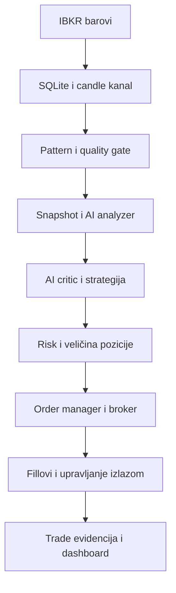

# Detaljni pregled projekta

Datum: 2026-09-21. Pregledana osnova: [`9f80683`](https://github.com/dejanakadex/aiTradingBot/tree/9f806833713d4b77f70275570e60dce2f8160aac).
Radni branch za nastavak: `trading-bot-v2`. Prijedlog nastavka: [V2_PLAN.md](V2_PLAN.md).

## Sažetak

Projekt već ima povezanu aplikacijsku arhitekturu: prikupljanje barova, feature/pattern obradu, AI analyzer i critic, strategiju, risk engine, naloge, upravljanje izlazom, SQLite i Blazor dashboard. Nije potreban novi projekt od nule.

Glavni problem su prijelazi između tih komponenti. Postoje provjere u pojedinačnim servisima koje produkcijski tok ne hrani potrebnim podacima ili koje ne pokrivaju stvarni redoslijed broker callbackova. Prioritet su ispravno izvršavanje, pouzdana evidencija i ponovljiv replay prije dodavanja modela.

Ovo je statički pregled izvornog koda, konfiguracije, migracija i testova. Nalazi ispod opisuju ono što kod radi i posljedice mogućih slijedova događaja; nisu rezultat izvršavanja aplikacije na TWS-u. U ovoj promjeni nisu popravljeni opisani funkcionalni propusti.

## Obuhvat i arhitektura

Pregledani su README, solution i svih šest projekata, DI registracije, konfiguracija, hosted servisi, broker/AI granice, persistence, UI kontrole te postojeća testna pokrivenost. Prije čišćenja bilo je 1.077 praćenih datoteka: 271 datoteka projekta, 803 generirane datoteke i tri datoteke runtime baze. U izvornom kodu testova pronađeno je 180 metoda označenih s `[Fact]` ili `[Theory]`; to nije broj izvršenih testnih slučajeva.

| Projekt | Uloga i stanje |
| --- | --- |
| `TradingBot.Domain` | Modeli, enumovi i osnovne invarijante cijena, pozicija i naloga. |
| `TradingBot.Application` | Ugovori servisa, konfiguracija i DTO modeli. |
| `TradingBot.Infrastructure` | Glavna logika, kanali, background servisi, OpenAI i uvjetno kompilirani IBKR adapter. |
| `TradingBot.Persistence` | EF Core 9, SQLite, migracije, audit tablice i popravak poznatih odstupanja sheme. |
| `TradingBot.Web` | Blazor Server dashboard, analytics, health endpointi i razvojna dijagnostika. |
| `TradingBot.Tests` | xUnit, in-memory SQLite i fake broker; postoje testovi mnogih zaštita, ali nedostaju ključni scenariji između servisa. |

Glavni tok:

Pozitivne postojeće osnove:

- Zadana konfiguracija koristi `AnalysisOnly`; live trading ima dodatnu eksplicitnu zastavicu i provjeru broker okruženja.
- AI nema pristup brokeru: strukturirani rezultat prolazi validator, strategiju i deterministički risk engine.
- Analyzer i critic odbijaju trgovanje kod nevaljanog izlaza i neuspjelog spremanja rezultata.
- Postoje početni reconciliation, provjera zaštitnog stopa, ATR trailing i audit promjena stopa.
- Podaci se spremaju prije objave candle događaja; povijesni seed ne pokreće automatski stare trade signale.
- `IDbContextFactory`, bounded channels, cancellation i jedinstveni indeks candle identiteta predstavljaju korisnu osnovu za nastavak.

## Prioriteti nalaza

**P1**: riješiti prije oslanjanja na automatsko broker izvršavanje. **P2**: riješiti prije pouzdanog istraživanja, ML evaluacije ili operativnog proširenja. Nema tvrdnje da su svi mogući runtime problemi pronađeni.

### R01 — P1: dnevne risk zaštite nemaju stvarnu povijest tradeova

Izvor: [PatternDecisionBackgroundService.cs](../TradingBot.Infrastructure/Background/PatternDecisionBackgroundService.cs#L282), `ProcessPatternAsync`; [RiskEngine.cs](../TradingBot.Infrastructure/Services/RiskEngine.cs).

Poziv `EvaluateAsync` uvijek dobiva `Array.Empty<Trade>()`. Zato provjere dnevnog gubitka, broja tradeova, uzastopnih gubitaka i cooldowna ne vide stvarne zatvorene tradeove, iako ih sam `RiskEngine` zna provjeravati. Postojeći unit testovi daju povijest izravno engineu i ne dokazuju ispravnost ovog pozivatelja. Uz to ovaj poziv koristi `IbkrSettings.AccountId`, dok se za paper način drugdje bira `PaperAccountId`.

Popravak: jedinstveno odabrani broker račun i dohvat provjerene povijesti za definiranu trading sesiju. Test: nakon stvarno evidentiranih gubitaka kandidat kroz cijeli pipeline mora biti odbijen prije slanja naloga.

### R02 — P1: iscrpljen leverage limit može se zanemariti

Izvor: [PositionSizer.cs](../TradingBot.Infrastructure/Services/PositionSizer.cs#L51), linije 51–63.

`Where(q => q > 0m)` uklanja nulti limit prije izračuna minimuma. Ako je `leverageRemaining = 0`, a ostali limiti pozitivni, sizer ipak vraća pozitivnu količinu. Primjer: limiti količine `[10, 10, 100, 0]` daju 10 umjesto 0. Trenutni limit broja pozicija može blokirati dio takvih situacija, ali sizer sam ne provodi obećanu granicu.

Popravak: nula u bilo kojem obveznom kapacitetu mora odbiti ulaz. U istom koraku definirati dopuštenu količinu i korak cijene instrumenta te vrednovanje postojeće izloženosti. Test: leverage točno na granici i preko granice, uz pozitivnu buying power.

### R03 — P1: maximum-holding izlaz može više puta prodati istu poziciju

Izvor: [ExitManagementService.cs](../TradingBot.Infrastructure/Services/ExitManagementService.cs#L371), `SubmitMaximumHoldingExitAsync` i `HandleOrderUpdateAsync`.

Nakon isteka vremena šalje se market SELL za cijeli `FilledQuantity`. Ne sprema se identitet tog izlaza u lifecycle zapis, ne prelazi se u `ExitPending` i nema koordinacije sa starim zaštitnim stopom. Obrada callbackova traži samo entry ID ili stop ID, pa fill tog market izlaza ne zatvara lifecycle zapis. Sljedeći candle može poslati još jedan SELL; postojeći stop također može ostati aktivan.

Popravak: idempotentan izlaz s trajnim ID-em i stanjem, usklađivanje preostale neto količine i koordinacija izlaznih naloga uz broker potvrde. Test: više candle događaja nakon timeouta, dupli callbackovi, djelomični fill i utrka market izlaza sa stopom; ukupno prodana količina ne smije prijeći kupljenu.

### R04 — P1: stvarni execution callback svako izvršenje označava kao potpuno

Izvor: [IbkrBrokerService.cs](../TradingBot.Infrastructure/Services/IbkrBrokerService.cs#L620), `execDetails`; [ExitManagementService.cs](../TradingBot.Infrastructure/Services/ExitManagementService.cs#L232).

`execDetails` bez obzira na ostatak naloga postavlja `Status = "Filled"` i `RemainingQuantity = 0`, a količinu uzima iz `execution.CumQty`. Kod djelomičnog izvršenja stopa exit servis stoga može zatvoriti cijeli lokalni trade dok broker još drži ostatak pozicije. Fake broker testovi proizvode pravilne djelomične statuse i ne provjeravaju ovu transformaciju stvarnog adaptera.

Popravak: odvojiti pojedinačni execution od kumulativnog order statusa i uskladiti ih bez pretpostavljanja krajnjeg stanja. Testirati točne adapter callbackove u oba redoslijeda (`execDetails` prije/poslije `orderStatus`) i ponovljene događaje.

### R05 — P1: fill može stići prije registracije zaštite ulaza

Izvor: [ApprovedOrderExecutionBackgroundService.cs](../TradingBot.Infrastructure/Background/ApprovedOrderExecutionBackgroundService.cs), `ExecuteAsync`; [ExitManagementService.cs](../TradingBot.Infrastructure/Services/ExitManagementService.cs#L91), `RegisterApprovedEntryAsync` i `HandleOrderUpdateAsync`.

Prvo se šalje entry, a tek nakon rezultata upisuje exit-management zapis. Callback koji stigne u tom intervalu nema zapis i ne čeka njegov nastanak. Registracija ponavlja samo fill količinu iz prvotnog rezultata submit poziva, koji je mogao biti samo potvrda slanja. Taj mogući redoslijed može ostaviti poziciju bez registriranog tradea i zaštite; monitor koji kreće od lokalnih tradeova ne može otkriti trade koji nije upisan.

Popravak: trajni intent prije slanja i obrada ranih fillova/reconciliation nad broker stanjem. Test: fill tijekom submit poziva, prije DB upisa, zatim restart između svakog koraka.

### R06 — P1: stop stanje i provjera zaštite nisu dovoljno pouzdani

Izvor: [ExitManagementService.cs](../TradingBot.Infrastructure/Services/ExitManagementService.cs#L388), `TryRaiseStopAsync`; [OrderManager.cs](../TradingBot.Infrastructure/Services/OrderManager.cs#L311), `UpsertOrderStatusAsync`; [ProtectiveStopMonitor.cs](../TradingBot.Infrastructure/Services/ProtectiveStopMonitor.cs).

- Nakon `TryRaiseStopAsync` postavljaju se BE/trailing zastavice iako metoda može preskočiti promjenu ili odbiti nalog. Trailing grana bezuvjetno postavlja `State = Trailing` i može prepisati prethodno postavljen `Faulted`.
- Order status update zamjenjuje cijeli `RawJson` i uklanja role/request metapodatke. Monitor upravo u tom JSON-u traži oznaku zaštitnog stopa, pa ga kasniji status može učiniti neprepoznatljivim.
- Monitor provjerava postoji li odgovarajući ID po simbolu, ali ne potvrđuje odgovaraju li strana, broker količina i stop cijena cijeloj preostaloj poziciji.
- Candle obrada zaključava po simbolu, a fill obrada po broker ID-u; isti lifecycle zapis time nije zaštićen jednim zaključavanjem.

Popravak: strukturirana order polja, potvrđene state tranzicije i jedna serijalizacija događaja po poziciji. Testovi trebaju odbijenu modifikaciju, premali stop, izgubljene metapodatke i istovremeni fill/candle.

### R07 — P1: cancel, nepoznati submit i idempotencija traže trajniji lifecycle

Izvor: [IbkrBrokerService.cs](../TradingBot.Infrastructure/Services/IbkrBrokerService.cs), `CancelOrderAsync`; [OrderManager.cs](../TradingBot.Infrastructure/Services/OrderManager.cs), `SubmitOrderToBrokerAsync`, `PersistOrderAsync`, `BuildOrderIdempotencyKey`; [BrokerStateReconciliationService.cs](../TradingBot.Infrastructure/Services/BrokerStateReconciliationService.cs); [ServiceCollectionExtensions.cs](../TradingBot.Infrastructure/ServiceCollectionExtensions.cs).

Adapter nakon `cancelOrder` odmah vraća `true`; manager to sprema kao `Cancelled` bez čekanja broker potvrde. Submit se šalje prije trajnog zapisa intenta. Callback može upisati order s praznim simbolom, nakon čega submit dodaje drugi zapis za isti broker ID. Indeks broker ID-a nije jedinstven; `ClientOrderKey` jest jedinstven samo za neprazne vrijednosti. Lockovi su po instanci, a manager je transient. Ključ uključuje vrijeme zahtjeva, pa novi zahtjev nakon restarta može imati drugi ključ za istu poslovnu namjeru.

Zapis `PendingBrokerConfirmation` s praznim broker ID-em izostavlja se iz usporedbe otvorenih lokalnih naloga. U situaciji bez drugih mismatcha time reconciliation može propustiti nerazriješenu namjeru. Postojeći test ponavljanja istog zahtjeva ne pokriva crash prije persistencea niti novi zahtjev s novim timestampom.

Popravak: trajni business ID, pending intent, potvrđeni cancellation, deduplikacija događaja i obvezno razrješenje svih nepoznatih stanja prije readinessa. Bracket već koristi parent/transmit polja; dodatno treba provjeriti dosljednost djece i oporavak nakon odbijenog child naloga.

### R08 — P1: UI zatvaranje ne šalje izlaz, a reconnect može poništiti pauzu

Izvor: [TradingControlService.cs](../TradingBot.Infrastructure/Services/TradingControlService.cs#L63), [RuntimeBrokerReconciliationHostedService.cs](../TradingBot.Infrastructure/Background/RuntimeBrokerReconciliationHostedService.cs), [Index.razor](../TradingBot.Web/Pages/Index.razor).

`CloseCurrentPositionAsync` samo postavlja pauzu i audit zapis; nema naloga koji zatvara poziciju. Kill switch mijenja engine state, ali ne otkazuje broker naloge. Nakon reconnecta reconciliation može postaviti `Ready`/enabled bez očuvanja prethodne ručne pauze ili kill switch odluke. Runtime promjena operating modea također nije potpuna promjena connection/account lifecyclea: neki servisi koriste početne options vrijednosti.

Popravak: odvojiti broker readiness od trajne korisničke dozvole za trgovanje, definirati točne semantike Pause/Close/Kill i jedinstveni account context. Test: pauza i kill moraju preživjeti reconnect/restart; Close mora pratiti stvarno zatvaranje preostale količine.

### R09 — P1: bar freshness ne uvažava trajanje timeframea

Izvor: [MarketDataValidator.cs](../TradingBot.Infrastructure/Services/MarketDataValidator.cs#L53), [StreamingBarCompletionBuffer.cs](../TradingBot.Infrastructure/Services/StreamingBarCompletionBuffer.cs), `IbkrBrokerService.ToMarketBar`.

Isti `MaximumCandleAgeSeconds = 300` uspoređuje se s timestampom svih barova. Buffer isporučuje prethodni bar tek kad stigne novi timestamp. Za barove označene vremenom početka, zatvoreni 15m bar tada već ima starost oko 900 sekundi i bit će odbačen; 5m bar dolazi na granicu ili preko nje. Seed dopušta stare podatke, a kasniji quality gate provjerava broj/trend viših timeframeova bez njihove posebne freshness provjere. Zato početna povijest može prikriti izostanak novih viših barova.

Popravak: eksplicitni početak/kraj bara, vrijeme primitka i freshness u odnosu na zatvaranje svake serije. Test: realistični timestampovi za 1m/5m/15m uz kašnjenje, zadnji bar sesije, out-of-order i prazninu u podacima. Potvrditi timestamp konvenciju na stvarnom TWS feedu.

### R10 — P1: spread i quote freshness nisu povezani s feedom

Izvor: [MarketSnapshotService.cs](../TradingBot.Infrastructure/Services/MarketSnapshotService.cs#L33), [StrategyEngine.cs](../TradingBot.Infrastructure/Services/StrategyEngine.cs#L147), `PatternDecisionBackgroundService` i `ApprovedOrderExecutionBackgroundService`.

Glavni poziv snapshot buildera ne šalje `currentPrice` ni `spread`. Cijena zato dolazi iz zadnjeg 1m closea, spread ostaje `null`, a spread provjera ga preskače. `CreatedAtUtc` je vrijeme izrade snapshota, ne vrijeme kotacije; njegov limit od 12 sekundi može isteći tijekom dva AI poziva. Odobreni plan se prije submitanja ne provjerava ponovno prema svježoj kotaciji i aktualnoj izloženosti. Red i risk odobrenje nemaju trajnu rezervaciju pozicije.

Popravak: bid/ask feed, timestamp izvora, obvezna svježina, rok odobrenja i provjera/reservation neposredno prije entryja. Test: nedostajući/stari quote, spor AI, dva odobrena plana prije prvog fill-a i promjena pozicije u međuvremenu.

### R11 — P2: audit i post-trade tok nisu zatvorena cjelina

Izvor: [PostTradeAnalysisService.cs](../TradingBot.Infrastructure/Services/PostTradeAnalysisService.cs), [PatternDecisionBackgroundService.cs](../TradingBot.Infrastructure/Background/PatternDecisionBackgroundService.cs#L411), `ExitManagementService.CloseRecordAsync`.

Pretraga poziva `StoreCompletedTradeAnalysisAsync` nalazi implementaciju, ugovor i test, ali nema produkcijskog pozivatelja. Stoga post-trade analytics ne treba tumačiti kao automatski popunjenu evidenciju kompletnog toka. Fixed-bracket put nema isti trade lifecycle kao ATR put. Pipeline audit helper hvata grešku upisa i samo logira da je kandidat fail-closed, a ne vraća neuspjeh koji bi zaustavio daljnju obradu.

Popravak: zajednički correlation ID od candle/snapshota do executiona i zatvorenog tradea; automatski idempotentan post-trade zapis za sve exit načine; audit koji je obvezan mora moći blokirati odobrenje. Test: cijeli ciklus entry → partial fills → exit → točno jedan post-trade zapis te kvar DB-a prije odobrenja.

### R12 — P2: provizije i execution količine nisu potpuna knjiga izvršenja

Izvor: [IbkrBrokerService.cs](../TradingBot.Infrastructure/Services/IbkrBrokerService.cs#L620), `commissionAndFeesReport`; [OrderManager.cs](../TradingBot.Infrastructure/Services/OrderManager.cs#L341).

Naknadna provizija ostaje u memorijskom dictionaryju i ne pokreće ažuriranje već spremljenog executiona. Execution zapis po jedinstvenom ID-u sadrži kumulativni `FilledQuantity`, uz cijenu zadnjeg fill-a; to se ne smije zbrajati kao količina pojedinačnih fillova. Status događaj bez execution ID-a dobiva sintetski ID pa je potrebno uskladiti status i stvarne executions prije P/L i trening labela.

Popravak: nepromjenjiv fill s pojedinačnom količinom, odvojeni kumulativni status i naknadno povezivanje provizije po execution ID-u. Test: provizija nakon fill-a, reconnect replay, dupli fill i djelomično zatvaranje.

### R13 — P2: vremenska konzistentnost podataka i featurea

Izvor: [MarketDataPipeline.cs](../TradingBot.Infrastructure/Services/MarketDataPipeline.cs), [CandleHistoryService.cs](../TradingBot.Infrastructure/Services/CandleHistoryService.cs), [FeatureEngine.cs](../TradingBot.Infrastructure/Services/FeatureEngine.cs), [MarketSnapshotService.cs](../TradingBot.Infrastructure/Services/MarketSnapshotService.cs).

- Postojeći candle timestamp u bazi ne ažurira OHLCV, iako dolazni candle može dalje biti objavljen. Ako seed sadrži još otvoreni bar, kasniji finalni bar može ostati različit u bazi i događaju.
- Povijest nema `asOf` granicu: queued događaj ili budući replay može dobiti candleove novije od vremena odluke. Tri timeframea čitaju se zasebno.
- VWAP se računa preko dostavljenog prozora bez resetiranja na početku sesije. Detector koristi drugačiji prozor od snapshota; isto ime indikatora ne znači isti izračun.
- Ravni niz bez dobitaka/gubitaka u RSI izračunu završava na 100. Jedinice volatilnosti treba eksplicitno imenovati: standardna devijacija povrata je omjer, dok konfiguracija koristi naziv `Percent`.

Popravak: canonical closed-bar dataset, event-time snapshot, zajedničke definicije featurea i session VWAP. Testirati look-ahead zabranu, idempotentne korekcije bara, session granice, flat RSI i jedinice.

### R14 — P2: quality score nije kalibrirana vjerojatnost

Izvor: [PatternDetector.cs](../TradingBot.Infrastructure/Services/PatternDetector.cs), [PatternQualityGate.cs](../TradingBot.Infrastructure/Services/PatternQualityGate.cs), [PatternDetectorOptions.cs](../TradingBot.Infrastructure/Options/PatternDetectorOptions.cs).

Weighted quality i contextual gate već postoje. Potrebni su precizniji negativni slučajevi: neke komponente engulfing/breakout scorea dosežu maksimum već samim prolaskom osnovnog uvjeta, hammer koristi meke scoreove i za geometriju, a double-bottom potvrda može ostati vezana uz raniji neckline break. Deduplikacija je po simbolu i patternu, bez timeframea. Nedostajuća geometrija/volume/context vrijednost može preskočiti odgovarajuću provjeru.

Popravak: dokumentirati hard uvjete, scoreove i njihovu domenu; odvojiti score od statističke vjerojatnosti ishoda; dedupe uključuje timeframe. Ocjenjivati na svim kandidatima i odbijenim slučajevima, uz troškove i neovisni vremenski test.

### R15 — P2: AI retry i usage evidencija ne predstavljaju svaki HTTP pokušaj

Izvor: [OpenAiMarketAnalyzer.cs](../TradingBot.Infrastructure/Services/OpenAiMarketAnalyzer.cs), [OpenAiTradeCritic.cs](../TradingBot.Infrastructure/Services/OpenAiTradeCritic.cs), [AiUsageLimiter.cs](../TradingBot.Infrastructure/Services/AiUsageLimiter.cs).

Usage provjera i upis su po završenom analyzer/critic pozivu, izvan retry petlje. Više HTTP pokušaja zato daje jedan usage zapis. Provjera nije atomska rezervacija i paralelni zahtjevi mogu proći istu preostalu kvotu. Catch za `HttpRequestException` ponavlja i iznimku nastalu zbog netransient statusa kad preostaje pokušaja. Greška upisa usage zapisa se logira bez zaustavljanja rezultata.

Popravak: dijeljen HTTP klijent/policy, odvojene metrike poslovnog poziva i pojedinog pokušaja, rezervacija budžeta te retry samo za izričito odabrane slučajeve. Prompt/model verzije već postoje; dodati verziju featurea i odluke. LLM confidence se ne smije prikazivati kao potvrđena vjerojatnost profita.

### R16 — P2: operativna pouzdanost i deploy nisu završeni

Izvor: [MarketDataSubscriptionHostedService.cs](../TradingBot.Infrastructure/Background/MarketDataSubscriptionHostedService.cs), [Program.cs](../TradingBot.Web/Program.cs), [MigrationHostedService.cs](../TradingBot.Persistence/MigrationHostedService.cs), [TradingBot.Infrastructure.csproj](../TradingBot.Infrastructure/TradingBot.Infrastructure.csproj).

- Jedan neuspjeli market stream može ostati neprimijećen dok `Task.WhenAll` čeka ostale aktivne streamove; prikupljanje je vezano uz trading readiness. Za dataset treba samostalna collection readiness i heartbeat po streamu.
- Dedupe dictionaryji u background/exit servisima nemaju ograničen rok zadržavanja. Potreban je bounded retention za dug rad.
- Reconciliation koristi cache otvorenih naloga; stvarni adapter ga ne gradi kao izolirani svježi snapshot pri svakom zahtjevu. Testirati nestale naloge nakon reconnecta i snapshot granice.
- Trading raspored pokriva sate/dane, ali nema kalendar blagdana i ranih zatvaranja tržišta.
- Web nema ugrađenu autentikaciju/autorizaciju za dashboard kontrole. Ako se izlaže mreži, pristup treba ograničiti i autentificirati; lokalni launch profil sam po sebi nije dokaz javne izloženosti.
- Startup mijenja DB shemu i radi dodatni schema repair. Postoje testovi poznatih repair slučajeva; treba dodati backup/restore i upgrade iz stvarnih prethodnih shema. SQLite je prihvatljiv početak za trenutni opseg, ali tick/L2 volumen treba odvojeno izmjeriti.
- Realni broker kod kompajlira se samo kad postoji `CSharpAPI.dll` na konfiguriranoj putanji. Običan test bez DLL-a ne dokazuje ni kompilaciju adaptera. Naknadni commit na radnom branchu dodaje .NET 10 `global.json`, usklađuje Microsoft pakete i uvodi CI; zasebna provjera s broker DLL-om i dalje je potrebna.

## Testna strategija nakon potvrde plana

Postojeći testovi pokrivaju mnogo happy-path i negativnih scenarija: risk engine, strategy gating, API fallback, fake partial fills, reconciliation mismatch, exit trailing, schema repair i UI analytics. Nedostajući najvažniji sloj je puni lifecycle s realističnim callbackovima i prekidima između koraka.

Minimalni redoslijed:

1. Risk kroz produkcijski pozivatelj: dnevni gubitak i iscrpljena izloženost.
2. Entry/fill/stop race, djelomični izlaz, cancel potvrda, timeout izlaz i duplikati.
3. Restart na svakoj trajnoj granici; očuvanje pause/kill i razrješenje unknown naloga.
4. Stvarni 1m/5m/15m timestampovi, bid/ask freshness, seed/final update i deterministički replay.
5. Trade ledger, naknadne provizije i post-trade zapis kroz cijeli tok.
6. Build bez IBKR DLL-a i build/test s odobrenom verzijom službenog DLL-a; zatim nadzirani TWS paper scenariji.

## Izvršene provjere i ograničenja

- Pregled izvornog koda i call-site pretrage; provjera da uklonjeni sadržaj pripada generiranim mapama ili runtime bazi.
- `dotnet test TradingBot.sln --no-restore` nije pokrenuo testove: `dotnet: command not found` (exit 127). SDK nije dostupan; pokušaj dohvata službenog instalacijskog programa istekao je na proxy vezi. Build, test prolaznost i runtime ponašanje nisu potvrđeni.
- Naknadno je solution prebačen na .NET 10 LTS i provjeren kroz GitHub Actions: Release build završio je bez upozorenja i grešaka, a prošlo je svih 195 testova bez preskočenih testova. Ta provjera koristi fallback kompilaciju bez službenog IBKR DLL-a.
- Nisu slani OpenAI zahtjevi niti broker nalozi; nisu mijenjani trading kod, postavke ili migracije.
- Ograničena pretraga credential obrazaca u izvornim tekstualnim datotekama nije našla podudaranja. To nije potpuni pregled Git povijesti, baze ili binarnih datoteka.
- Prošli su `git diff --check` i `git diff --cached --check`, XML/JSON provjera praćenih project/config datoteka, provjera lokalnih dokumentacijskih poveznica i ignore pravila. Sve prethodno praćene datoteke izvan dogovorenog čišćenja, README-a i `.gitignore` uspoređene su s osnovnim commitom i ostale su identične bajt po bajt. Nakon dodavanja dvaju dokumenata branch ima 273 praćene datoteke.

## Čišćenje u ovom branchu

- Uklonjeno 803 praćenih generiranih datoteka: `.verify-bin` 268, `.vs` 16, `bin` 366, `obj` 153.
- Tri datoteke `TradingBot.Web/Data/trading.db*` uklonjene su iz Git praćenja; lokalne kopije sačuvane su i provjerene hashom prije/poslije.
- `.gitignore` sada pokriva navedene build/IDE mape, test/coverage rezultate, runtime SQLite baze i sidecare, logove i lokalne settings datoteke.
- Migrations, izvorni kod, UI assets i zajednička konfiguracija ostaju praćeni. Placeholder servisi nisu brisani jer su neki namjerno dio fallback registracije.
- README je usklađen s utvrđenim stanjem i povezan s ovim pregledom i planom. Povijest repozitorija nije prepisivana: stare verzije generiranih datoteka i baze ostaju u ranijim commitovima.
- Kod prelaska na ovaj branch iz starog checkouta napraviti vlastitu sigurnosnu kopiju runtime baze prije switcha: Git može ukloniti prethodno praćene datoteke. Sačuvana kopija iz ove revizije nalazi se samo u radnom checkoutu ove sesije.
